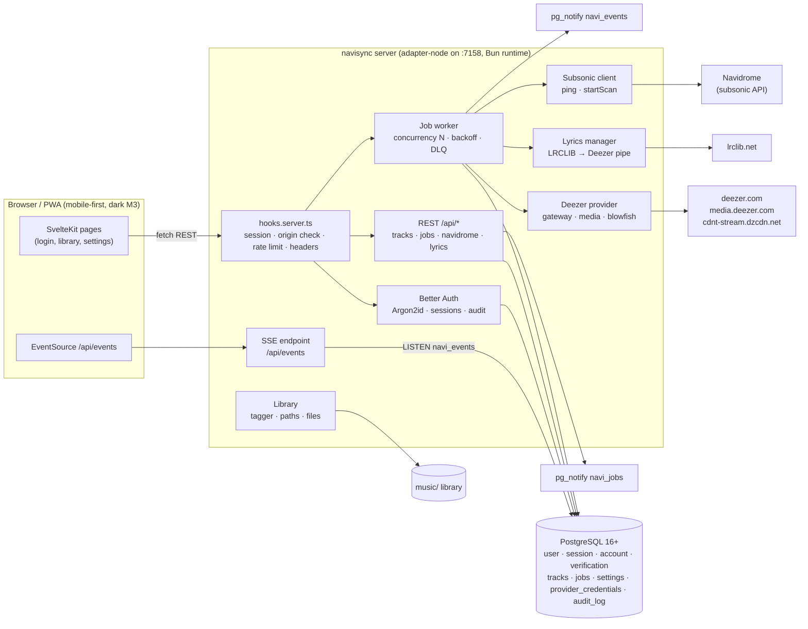
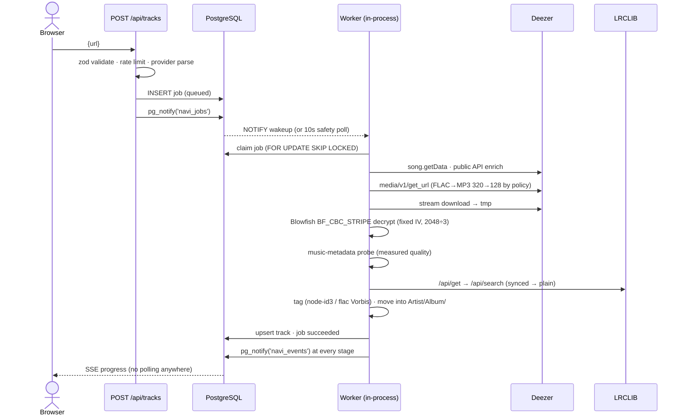

# Architecture

## Component overview (Phase 1 — Node monolith, ADR-0001)

## Request/queue flow (download)

## Key decisions

- **ADR-0001 — Node-first monolith** (owner decision): everything in one
  SvelteKit process. The Tauri/Rust engine was deferred; the seams to extract
  it are already in place (ADR-0002).
- **ADR-0002 — PostgreSQL is the only bus**: jobs are claimed with
  `FOR UPDATE SKIP LOCKED`, wakeups and progress travel over `NOTIFY`
  channels. A future Rust engine becomes just another consumer — no API
  changes.
- **ADR-0003 — Deezer method** mirrors LuftVerbot/echo-deezer-extension:
  email/password → ARL, gateway with CSRF recovery, `media/v1/get_url`,
  local Blowfish decryption (fixed IV `0001020304050607`, 2048-byte stripes,
  every 3rd encrypted — verified against live streams 2026-10). No
  third-party resolvers by default (`DEEZER_RESOLVER_URL` optional fallback).

## Data flow guarantees

1. **Real-time without polling**: enqueue → `pg_notify('navi_jobs')` → worker
   wake; progress → `pg_notify('navi_events')` → SSE → `EventSource`. The 10s
   poller is a safety net, not the mechanism.
2. **Measured quality**: DB stores what `music-metadata` probed from the
   decrypted file, never provider claims.
3. **Integrity**: SHA-256 over decrypted bytes stored per track; temp files
   cleaned in `finally`-style paths + stale purge on boot.
4. **Failure semantics**: retryable failures → backoff (30s/60s/120s); final
   failure → `dead` (dead-letter) with actionable error; user cancel →
   `cancelled` via abort watcher; SIGTERM → drain ≤ 30s.

## Phase-2/3 seams (already present)

- `providers/registry.ts` — ordered provider chain for multi-source routing.
- `jobs.type` — `export` and future types plug into the same dispatcher.
- `pg-events.ts` + queue contract — drop-in Rust/Tauri engine later.
- `lyricsSources[]` — add sources by appending to the traversal list.
