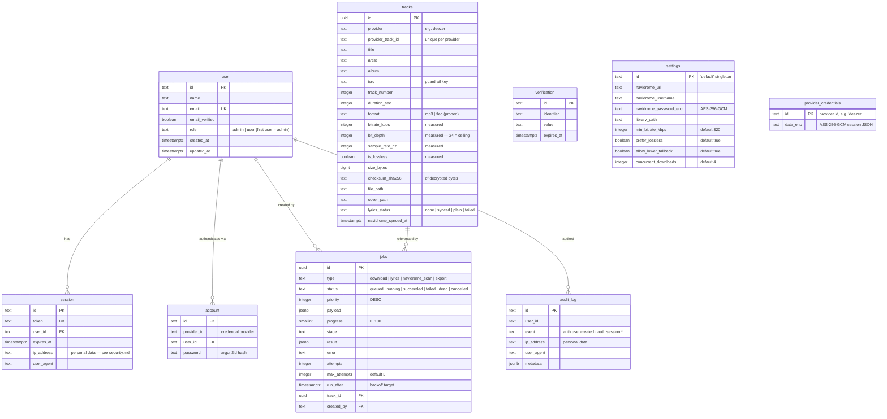

# Database

PostgreSQL 16+ · Drizzle ORM · migrations in `drizzle/` (applied
automatically, idempotently, on server boot; manual: `bun run db:migrate`).

Create the dedicated database first: `bun run db:create` (defaults to
`navisync`; override with `DATABASE_NAME`).

## ER diagram

## Index design

| Table       | Index                                          | Purpose                                |
| ----------- | ---------------------------------------------- | -------------------------------------- |
| `tracks`    | `UNIQUE(provider, provider_id)`                | dedupe + upsert target                 |
| `tracks`    | `isrc`, `artist`, `created_at`                 | guardrail lookup, listing, sort        |
| `jobs`      | `(status, priority, run_after)`                | claim query (`SKIP LOCKED`) — hot path |
| `session`   | `user_id`                                      | auth joins                             |
| `audit_log` | `(user_id, created_at)`, `(event, created_at)` | anomaly review                         |

Performance: track listing is server-paginated (≤100/page) over indexed
columns — the 1000-track <500ms budget holds trivially at Phase-1 scale.

## Seed data

`bun run db:seed` (dev only, refuses any database not named `navisync`):
ensures the `settings` singleton. Users are **not** seeded — create the first
account via `/login` (databaseHook promotes it to `admin`).

## GDPR notes

- `DELETE /api/tracks/:id` removes the row **and** audio/lyrics/cover files.
- User deletion (`DELETE /api/auth/delete-user` or admin action) cascades
  sessions/accounts; audit_log retains an anonymizable marker — see
  [security.md](security.md#gdpr).
- IPs are personal data: recorded in `session.ip_address` and `audit_log`
  only; retention policy in [security.md](security.md).
